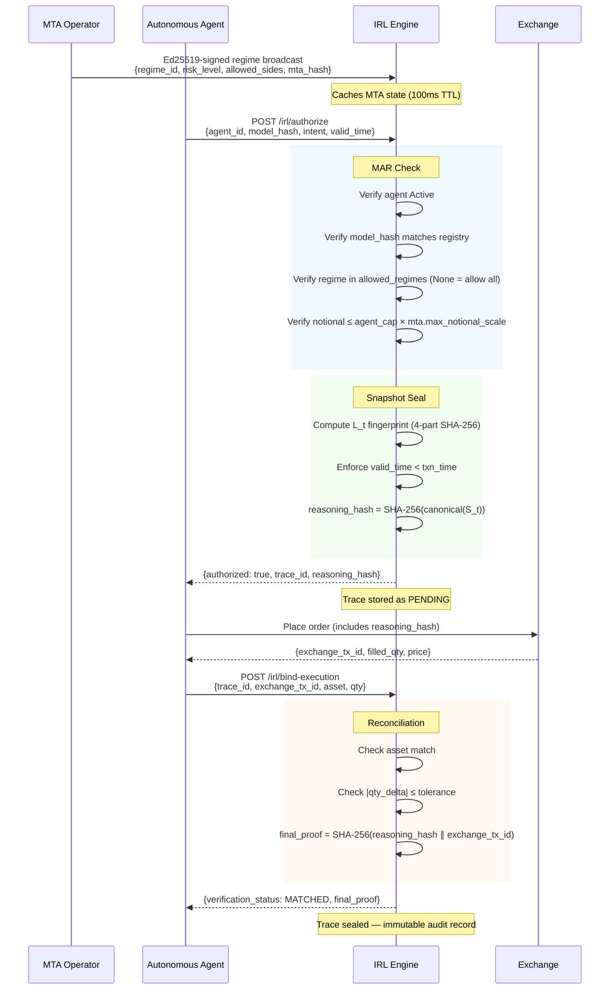
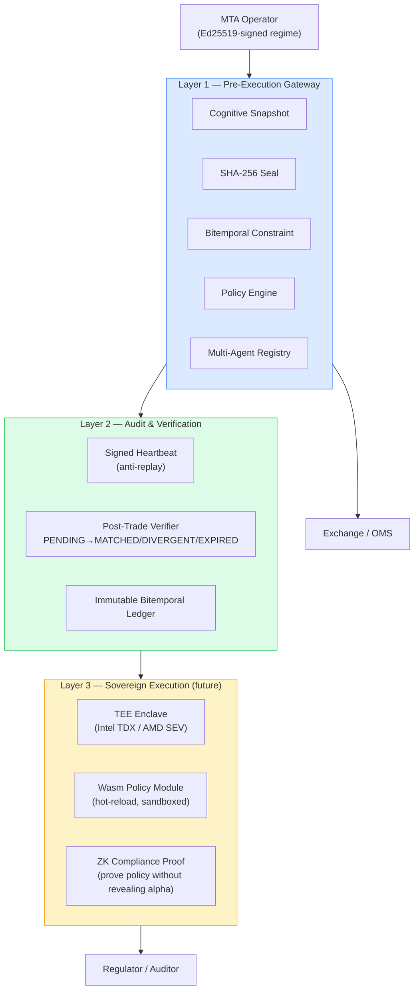
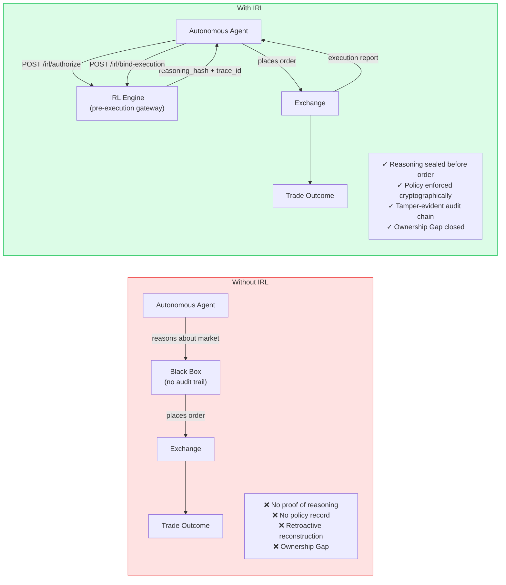
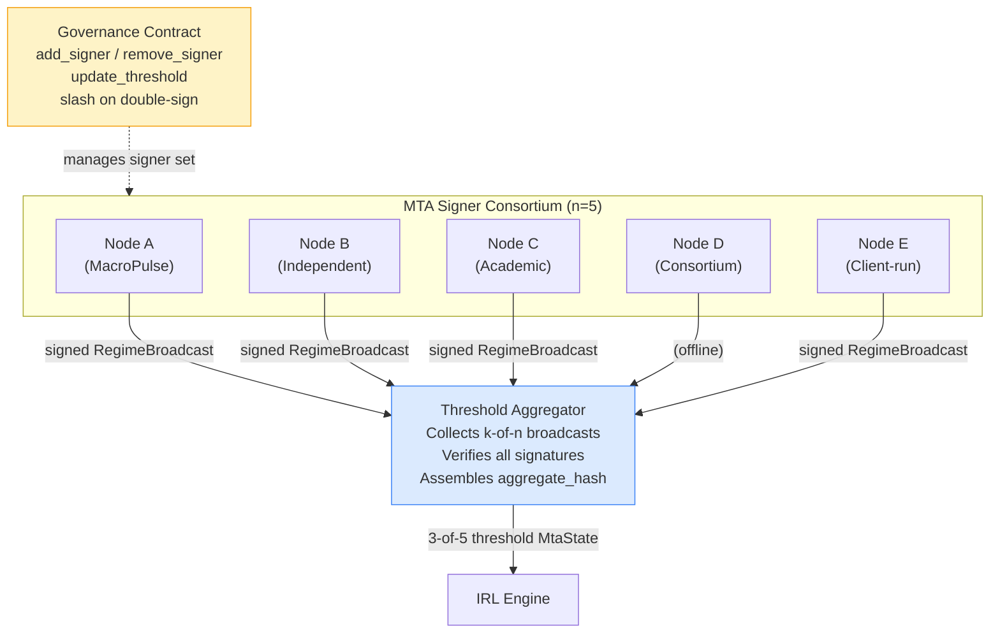
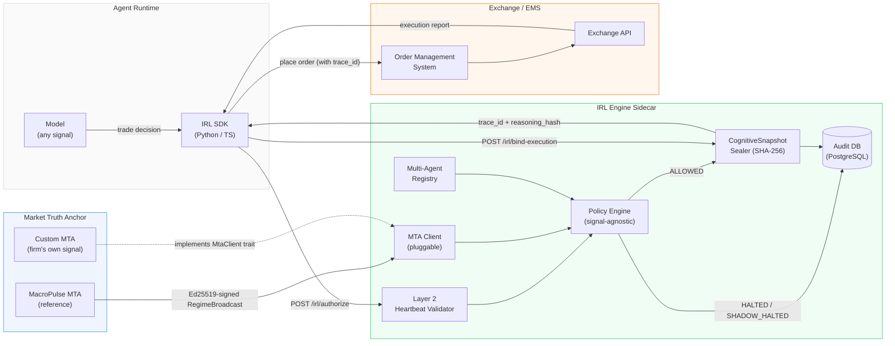

# IRL Diagrams — Mermaid Specs

*v1.0 · March 2026*

Professional diagrams for the whitepaper. Each block below is a Mermaid diagram
ready to render at mermaid.live or hand off to a designer as a structural spec.

---

## Diagram 1 — End-to-End Execution Flow

---

## Diagram 2 — Cognitive Snapshot Anatomy

```mermaid
block-beta
    columns 3

    block:snapshot["Cognitive Snapshot  S_t"]:3
        block:Rt["R_t — Reasoning State"]:1
            mta["MTA regime\n(operator-signed)"]
            policy["Policy decision\n(constraints → ALLOWED/HALTED)"]
            lf["L_t latent fingerprint\nSHA-256(model∥prompt∥schema∥hyperparams)"]
        end

        block:Et["E_t — Execution Intent"]:1
            action["Action\n(Long/Short/Neutral + size)"]
            asset["Asset + Venue"]
            qty["Quantity + Notional"]
            order_type["Order Type\n(MARKET/LIMIT/TWAP/VWAP)"]
        end

        block:tt["τ_t — Temporal Proof"]:1
            valid_t["valid_time\n(agent's clock at reasoning)"]
            txn_t["txn_time\n(IRL engine wall clock)"]
            constraint["Invariant:\nvalid_time < txn_time"]
        end
    end

    hash["reasoning_hash = SHA-256(RFC 8785 canonical JSON of S_t)"]:3
```

---

## Diagram 3 — Three-Layer Trust Model

---

## Diagram 4 — The Ownership Gap: Before and After IRL

---

## Diagram 5 — Multi-MTA Consensus (Phase 2+)

---

---

## Diagram 6 — IRL in the Stack

How IRL fits between the agent runtime and the exchange — showing where the
compliance sidecar intercepts, what layers surround it, and which components
can be swapped by the operator.

**Reading the diagram:**
- The IRL sidecar is a network boundary — the agent SDK calls it over HTTP before
  placing any order. The exchange never receives an unauthorized intent.
- The MTA Client box is the only external dependency. Swap `MacroPulseMtaClient`
  for any `MtaClient` implementation to use a different regime signal.
- The Policy Engine reads only `allowed_sides` and `max_notional_scale` from the
  MTA state. It has no embedded knowledge of specific regime taxonomies.
- Shadow mode: when `SHADOW_MODE=true`, `HALTED` decisions write to the DB as
  `SHADOW_HALTED` and return `shadow_blocked: true` in the authorize response,
  without blocking the order flow.

---

## Design Notes for the Designer

- **Color palette**: Blue for L1/trust infrastructure, Green for verified/matched states,
  Amber for future/L3 work, Red for violations/divergence.
- **Font**: Use a monospace font for hash values and JSON snippets in diagrams.
- **Diagram 4** (Ownership Gap) is the most important for non-technical audiences —
  compliance officers and investors. Make it the largest and clearest.
- **Diagram 1** (sequence) is the most important for technical buyers — CTOs and
  quant teams. The flow should feel rigorous, not complex.
- All diagrams should be available in both light and dark versions for slide decks.
